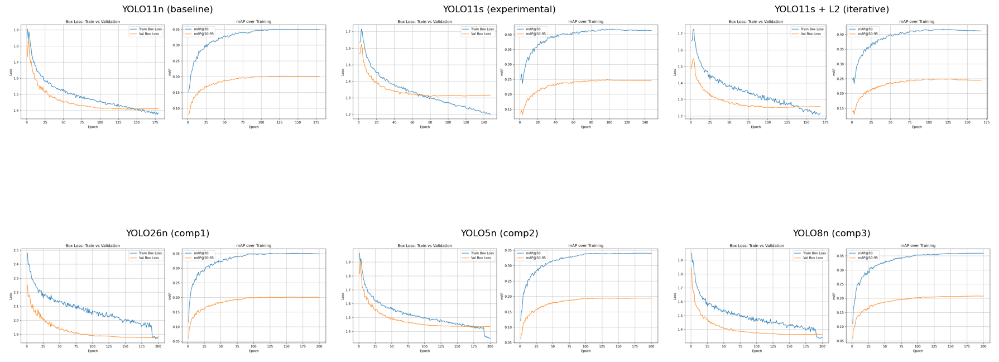
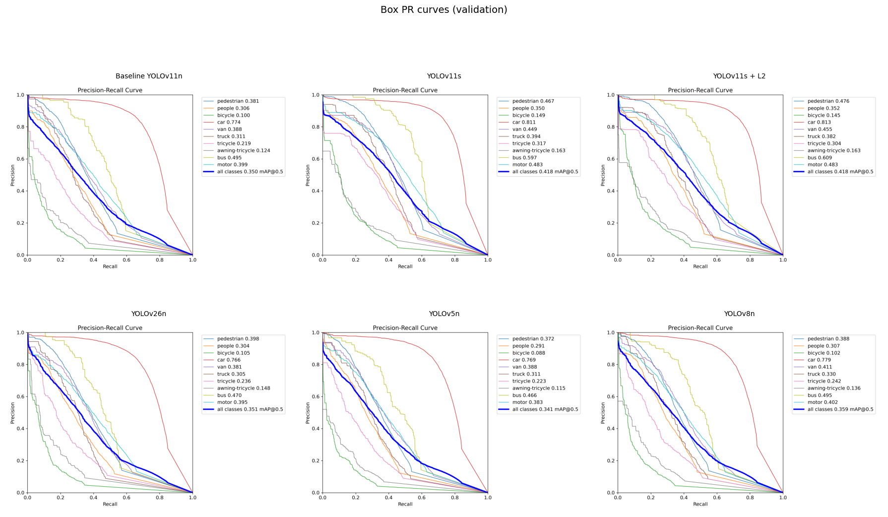
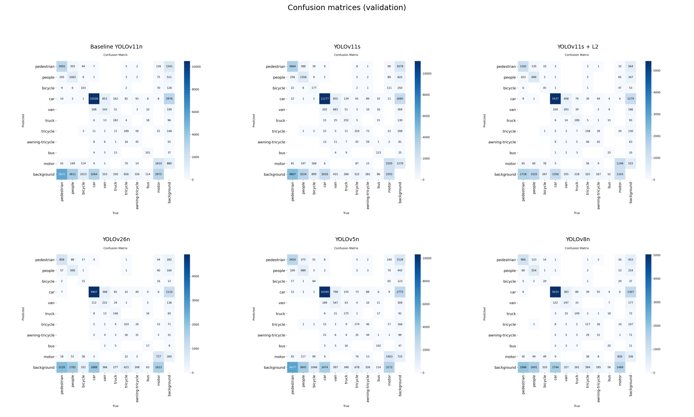
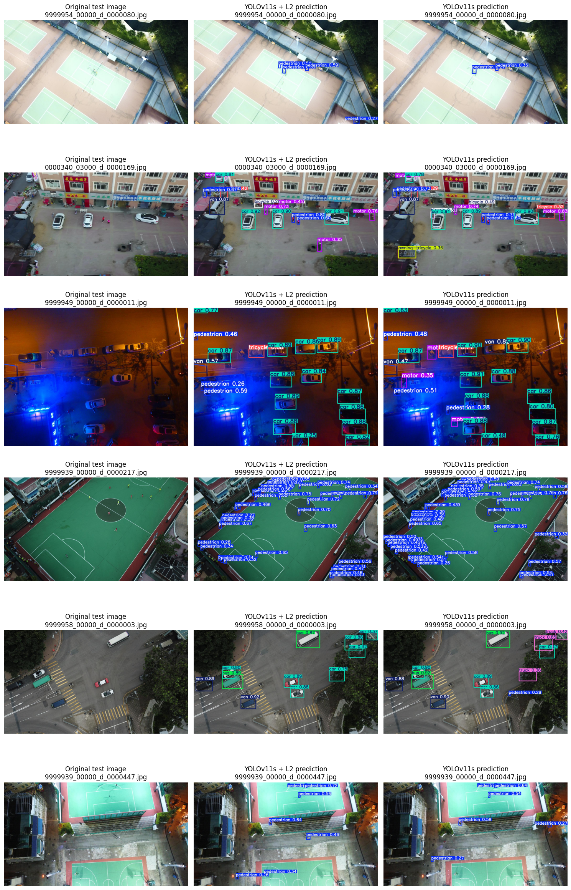

# VisDrone Drone-View Object Detection

This repository contains my CMPE 401 Project: an end-to-end drone-view object detection pipeline on the VisDrone2019-DET dataset using multiple YOLO variants.

The objective of this project is to understand the full object-detection pipeline, design and execute structured experiments, and evaluate and compare the results across several YOLO architectures.

The structure:

- [**Task 1 – Dataset and Preprocessing**](#task-1--dataset-and-preprocessing-visdrone2019-det)
- [**Task 2 – Baseline Model**](#task-2--baseline-model-yolov11n)
- [**Task 3 – Experimental Design (Alternate Model)**](#task-3--experimental-design-larger-model-yolov11s)
- [**Task 4 – Iterative Model Improvement**](#task-4--iterative-improvement-yolov11s--stronger-l2-weight-decay)
- [**Task 5 – Comparative Analysis and Discussion**](#task-5--comparative-study-yolov26n-yolov5n-yolov8n)
- [**Task 6 – Test-Challenge Evaluation**](#task-6--test-challenge-evaluation)

Below, each task is mapped to concrete notebooks, models, metrics, and results.

---

## Repository Structure

```text
yolo/
├── *.ipynb                         # Training, analysis, and evaluation notebooks
├── Analysis/                       # Per-model and comparison analysis notebooks
├── baseline_yolo11n_export/        # Baseline YOLOv11n trained run
├── baseline_yolo11s_export/        # YOLOv11s trained run
├── yolo11s_l2_export/              # YOLOv11s + L2 trained run
├── comparison*_export/             # YOLOv26n, YOLOv5n, YOLOv8n trained runs
├── test_predictions_l2/            # YOLOv11s + L2 test-challenge predictions
├── test_predictions_s/             # YOLOv11s test-challenge predictions (if used)
├── VisDrone/                       # Local copy of VisDrone2019-DET dataset
└── images/                         # Saved comparison / test visualization figures
```


## Setup and Requirements

- Python 3.10 or later.
- GPU environment recommended for training (Kaggle or Colab)
- CPU can be used but takes many hours to run.
- Core Python dependencies:
  - `ultralytics` (YOLO)
  - `torch`, `torchvision`
  - `numpy`, `pandas`, `matplotlib`, `seaborn`
  - `opencv-python`

You can install a minimal environment with:

```bash
pip install ultralytics torch torchvision opencv-python numpy pandas matplotlib seaborn
```

All experiments were run in notebook-based GPU environments (Kaggle & Colab). Each export folder contains an `data.yaml` file that records the exact Ultralytics training configuration used.


## Data (VisDrone2019-DET)

This project uses the VisDrone2019-DET detection dataset.

1. Download the VisDrone2019-DET dataset from the official [VisDrone website](https://github.com/VisDrone/VisDrone-Dataset).
2. Place the extracted folders so that the structure under `VisDrone/` matches:

```text
VisDrone/
  VisDrone2019-DET-train/
  VisDrone2019-DET-val/
  VisDrone2019-DET-test-challenge/
```

The `data.yaml` files in the `*_export/` folders and in `test_data.yaml` expect this layout (or the equivalent Kaggle path variant shown below in Task 1).


## Task 1 – Dataset and Preprocessing (VisDrone2019-DET)

**Goal:** Prepare the VisDrone detection dataset in a YOLO-ready format, with clear class definitions and train/val/test splits.

**Dataset:** VisDrone2019-DET (drone-view object detection)

- Data config used during training: [baseline_yolo11n_export/data.yaml](baseline_yolo11n_export/data.yaml), [baseline_yolo11s_export/data.yaml](baseline_yolo11s_export/data.yaml), [comparison1_yolo26n_export/data.yaml](comparison1_yolo26n_export/data.yaml), [comparison2_yolo5n_export/data.yaml](comparison2_yolo5n_export/data.yaml), [comparison3_yolo8n_export/data.yaml](comparison3_yolo8n_export/data.yaml).
- Paths (Kaggle-style):
  - `path: /kaggle/input/datasets/dabiraomotoso/visdrone/VisDrone`
  - `train: VisDrone2019-DET-train/images`
  - `val: VisDrone2019-DET-val/images`
  - `test: VisDrone2019-DET-test-challenge/images`
- Number of classes: $nc = 10$
- Class names:
  - 0: pedestrian  
  - 1: people  
  - 2: bicycle  
  - 3: car  
  - 4: van  
  - 5: truck  
  - 6: tricycle  
  - 7: awning-tricycle  
  - 8: bus  
  - 9: motor

**Notebook:** [Preprocessing_VisDrone.ipynb](Preprocessing_VisDrone.ipynb)

What I do in this task:

- Inspect the raw VisDrone annotations and images.
- Convert annotations into the YOLO format (normalized $(x, y, w, h)$ with class IDs).
- Organize train/val/test-challenge splits.
- Verify label sanity (spot-check images and bounding boxes).

**Outputs / artifacts:**

- A consistent VisDrone layout pointed to by all `data.yaml` files.
- Verified labels and splits used by every model in this project.

---

## Task 2 – Baseline Model: YOLOv11n

**Goal:** Train a small baseline YOLO model on VisDrone to establish reference metrics and behavior.

**Notebook:** [baseline-model.ipynb](baseline-model.ipynb)

**Model:** YOLOv11n ("nano"-sized, lightweight)

**Key training details (high level):**

- Framework: Ultralytics YOLO.
- Data config: VisDrone `data.yaml` from Task 1.
- Training environment: GPU notebook (Kaggle/Colab-style).
- Standard hyperparameters for a first run (default Ultralytics schedule, modest epochs).

**Baseline Setup for training:**
- **Model** = YOLO11n
- **Data** = YAML_PATH (`data.yaml` path)
- **Epochs** = 200
- **imgsz** = 640
- **Batch**    = 16
- **patience** = 50 (for early stopping when there has been no improvement for the last 50 epochs)

**Export and artifacts:**

- Output folder: [baseline_yolo11n_export/runs/baseline_yolo11n](baseline_yolo11n_export/runs/baseline_yolo11n)
- Important files:
  - Training metrics curves: `results.png`
  - Box-level curves: `BoxP_curve.png`, `BoxR_curve.png`, `BoxF1_curve.png`, `BoxPR_curve.png`
  - Confusion matrices: `confusion_matrix.png`, `confusion_matrix_normalized.png`
  - Batches: `train_batch*.jpg`, `val_batch*_labels.jpg`, `val_batch*_pred.jpg`
  - Numeric log: `results.csv`
  - Hyperparameters: `args.yaml`

**Baseline results (last logged epoch):**

From [baseline_yolo11n_export/runs/baseline_yolo11n/results.csv](baseline_yolo11n_export/runs/baseline_yolo11n/results.csv), final-epoch detection metrics:

- Precision: $P \approx 0.4472$
- Recall: $R \approx 0.3466$
- $\text{mAP@50} \approx 0.3494$
- $\text{mAP@50-95} \approx 0.2014$

**Interpretation (Summary Table):**

| Observation | What Was Seen | Possible Reason |
|---|---|---|
| Mild overfitting | Validation loss is slightly higher than training loss (gap ~0.025) when we plot training vs validation loss | The dataset size per class is limited relative to the model parameters, so the nano model can slightly overfit the available examples |
| Model converged before epoch 179 | Training and validation losses both decrease and then stop improving; early stopping triggers around epoch 129 | The learning rate schedule slows updates and the model has already learned most patterns the VisDrone dataset can offer to this small architecture |
| No strong underfitting (performance ceiling) | Training loss steadily decreases and validation loss follows closely; mAP@50 rises and then stabilises around ~0.35 rather than staying low | Within the limits of the VisDrone dataset size and the nano model capacity, the model has learned most of what it can; further gains would require more data or a larger model, not just more epochs |
| Low recall (~0.35) | The model misses a noticeable number of ground-truth objects in the validation set | Some classes likely have too few training samples and objects are small, so with limited capacity the nano model struggles to detect all categories reliably on this dataset |

For detailed loss curves and over/underfitting analysis, see  
[Analysis/baseline-model-analysis.ipynb](Analysis/baseline-model-analysis.ipynb).

---

## Task 3 – Experimental Design: Larger Model YOLOv11s

**Goal:** Design an experiment to see how a larger model capacity affects performance and fitting behavior on the same dataset.

**Notebook:** [experimental-design.ipynb](experimental-design.ipynb)

**Model:** YOLOv11s ("small" model, more parameters than YOLOv11n)

**Rationale:**

- Hypothesis: increasing model capacity will improve $\text{mAP}$ on VisDrone, at the cost of longer training time and potentially more overfitting.

**Setup for training:**
- **Model** = YOLO11s
- **Data** = YAML_PATH (`data.yaml` path)
- **Epochs** = 200
- **imgsz** = 640
- **Batch**    = 16
- **patience** = 50 (for early stopping when there has been no improvement for the last 50 epochs)

**Export and artifacts:**

- Output folder: [baseline_yolo11s_export/runs/baseline_yolo11s](baseline_yolo11s_export/runs/baseline_yolo11s)
- Important files mirror the baseline run (curves, confusion matrices, batches, `results.csv`, `args.yaml`).

**YOLOv11s results (last logged epoch):**

- Precision: $P \approx 0.5294$
- Recall: $R \approx 0.4014$
- $\text{mAP@50} \approx 0.4135$
- $\text{mAP@50-95} \approx 0.2456$

**Interpretation:**

| Observation | What Was Seen | Possible Reason |
|---|---|---|
| Mild to moderate overfitting | Validation loss is higher than training loss (gap ~0.118) when we plot training vs validation loss | Larger model capacity relative to the same dataset size increases the tendency to overfit |
| Model converged before epoch 200 | Both training and validation losses stop improving and early stopping triggers at epoch 147 | Learning rate scheduling slows updates and the model has already learned most of what the VisDrone dataset can offer this small architecture |
| Improved mAP@50 (~0.41 vs 0.35) | The larger YOLOv11s model achieves better mAP@50 (≈0.4135) and mAP@50–95 (≈0.2456) than the YOLOv11n baseline | YOLOv11s has more parameters and can learn more complex features than YOLOv11n, improving detection across classes |
| Improved recall (0.40 vs 0.35) | Recall improves from ≈0.3466 (YOLOv11n) to ≈0.4014 (YOLOv11s), meaning more ground-truth objects are detected | Increased model capacity helps reduce false negatives, though the fixed dataset size still limits absolute recall |

For more discussion and plots, see  
[Analysis/experimental-design-analysis.ipynb](Analysis/experimental-design-analysis.ipynb).

---

## Task 4 – Iterative Improvement: YOLOv11s + Stronger L2 (Weight Decay)

**Goal:** After seeing YOLOv11s overfit more, introduce stronger L2 regularization (weight decay) and iterate on the model to improve generalization.

**Notebook:** [iterative-model.ipynb](iterative-model.ipynb)

**Setup for training:**
- **Model:** YOLOv11s with increased weight decay (L2 regularization)
- **Data** = YAML_PATH (`data.yaml` path)
- **Epochs** = 200
- **imgsz** = 640
- **Batch**    = 16
- **Weight decay** = 0.001 (L2 regularization)
- **patience** = 50 (for early stopping when there has been no improvement for the last 50 epochs)


**Export and artifacts:**

- Export root: [yolo11s_l2_export](yolo11s_l2_export)
- Output folder: [yolo11s_l2_export/runs/yolo11s_l2](yolo11s_l2_export/runs/yolo11s_l2)
- Additional artifact: `loss_curves.png` in [yolo11s_l2_export](yolo11s_l2_export) summarizing convergence.

**YOLOv11s + L2 results (last logged epoch 168):**  
(from [yolo11s_l2_export/runs/yolo11s_l2/results.csv](yolo11s_l2_export/runs/yolo11s_l2/results.csv))

- Precision: $P \approx 0.5304$
- Recall: $R \approx 0.3978$
- $\text{mAP@50} \approx 0.4122$
- $\text{mAP@50-95} \approx 0.245$

**Interpretation:**

| Observation | What Was Seen | Possible Reason |
|---|---|---|
| Reduced overfitting | Train/val gap dropped from ~0.118 (YOLOv11s) to ~0.038 (YOLOv11s + L2) | L2 regularization (weight decay = 0.001) penalized large parameter values and improved generalization |
| Preserved mAP | mAP@50 of 0.4122 vs 0.4135 in YOLOv11s | Weight decay was not too aggressive, allowing the model to maintain detection performance |
| Model converged before epoch 200 | Early stopping triggered at epoch 168 | Learning rate scheduling slowed updates and the model had learned most of what the dataset could offer this architecture |
| Recall slightly lower (0.3978 vs 0.4014) | Marginally fewer true detections compared to YOLOv11s | Regularization slightly constrained the model's sensitivity, though the difference is very small |

**Conclusion:** Stronger L2 regularization successfully reduced overfitting while essentially preserving mAP, making YOLOv11s + L2 the best generalizing model in this project. This suggests that L2 regularization is an effective and low-cost technique for improving generalization in YOLO models when training on a fixed dataset. 

Detailed curves and comments are in  
[Analysis/iterative-model-analysis.ipynb](Analysis/iterative-model-analysis.ipynb).

---

## Task 5 – Comparative Study: YOLOv26n, YOLOv5n, YOLOv8n

**Goal:** Compare different YOLO families (versions) on the same VisDrone configuration to understand how architecture/version choice influences performance.

**Notebooks:**

- [comparison-model1.ipynb](comparison-model1.ipynb): YOLOv26n
- [comparison-model2.ipynb](comparison-model2.ipynb): YOLOv5n
- [comparison-model3.ipynb](comparison-model3.ipynb): YOLOv8n

**Setup for training:**
- **Models** = YOLO26n, YOLO5n, YOLO8n
- **Data** = YAML_PATH (`data.yaml` path)
- **Epochs** = 200
- **imgsz** = 640
- **Batch**    = 16
- **patience** = 50 (for early stopping when there has been no improvement for the last 50 epochs)

**Exports and artifacts:**

- YOLOv26n: [comparison1_yolo26n_export/runs/comparison1_yolo26n](comparison1_yolo26n_export/runs/comparison1_yolo26n)
- YOLOv5n: [comparison2_yolo5n_export/runs/comparison2_yolo5n](comparison2_yolo5n_export/runs/comparison2_yolo5n)
- YOLOv8n: [comparison3_yolo8n_export/runs/comparison3_yolo8n](comparison3_yolo8n_export/runs/comparison3_yolo8n)

Each run contains:

- `results.png` with train/val curves
- Box-level metric curves (`BoxP/R/F1/PR`)
- Confusion matrices
- `loss_map_curves.png` (for comparison runs)
- Batch visualizations of predictions and labels
- `results.csv` with per-epoch metrics

**Final-epoch metrics:**

From each `results.csv`:

- **YOLOv26n** (comparison1):
  - $P \approx 0.4640$
  - $R \approx 0.3430$
  - $\text{mAP@50} \approx 0.3491$
  - $\text{mAP@50-95} \approx 0.2006$
- **YOLOv5n** (comparison2):
  - $P \approx 0.4353$
  - $R \approx 0.3441$
  - $\text{mAP@50} \approx 0.3401$
  - $\text{mAP@50-95} \approx 0.1943$
- **YOLOv8n** (comparison3):
  - $P \approx 0.4751$
  - $R \approx 0.3487$
  - $\text{mAP@50} \approx 0.3595$
  - $\text{mAP@50-95} \approx 0.2080$

**Interpretation:**

**Comparison model 1 – YOLOv26n**

| Observation | What Was Seen | Possible Reason |
|---|---|---|
| No overfitting | Training and validation loss nearly identical (gap ~-0.006) | YOLOv26n architecture may have stronger built-in regularization |
| Model ran full 200 epochs | Early stopping did not trigger | YOLOv26n requires more epochs to converge on this dataset |
| Similar mAP to baseline (0.3491 vs 0.3494) | No significant improvement over YOLOv11n | Model had not fully converged; more epochs may show improvement |
| Lower recall than baseline (0.3430 vs 0.3467) | Slightly fewer true detections | Similar class imbalance challenges affect both architectures equally |

**Comparison model 2 – YOLOv5n**

| Observation | What Was Seen | Possible Reason |
|---|---|---|
| Mild overfitting | Validation box loss > training (gap ~0.084) | Train/val mismatch larger than baseline (~0.025); different inductive bias and optimization in YOLOv5n |
| Full 200 epochs | Patience did not stop training early | Metric still changing slowly or optimizer still updating in late epochs |
| Slightly lower mAP@50 | 0.3401 vs baseline 0.3494 | YOLOv5n does not outperform YOLOv11n here under identical configured training |
| Precision a bit lower | ~0.435 vs baseline ~0.447 | Comparable recall-driven limits; precision–recall trade-offs differ slightly by architecture |

**Comparison model 3 – YOLOv8n**

| Observation | What Was Seen | Possible Reason |
|---|---|---|
| Mild, small train/val gap | Box-loss gap ~0.021 | Good alignment of train and val; no strong memorization |
| Full 200 epochs | Patience did not stop early | Late-epoch updates still small but non-trivial |
| Higher mAP@50 than baseline | ~0.359 vs ~0.349 | YOLOv8n performs better on this dataset for mAP@50 |
| Higher precision, similar recall | ~0.475 vs ~0.447 precision; ~0.349 vs ~0.347 recall | The model is more confident and accurate on the positives it predicts |

Per-experiment analysis notebooks:

- [Analysis/comparison1-model-analysis.ipynb](Analysis/comparison1-model-analysis.ipynb)
- [Analysis/comparison2-model-analysis.ipynb](Analysis/comparison2-model-analysis.ipynb)
- [Analysis/comparison3-model-analysis.ipynb](Analysis/comparison3-model-analysis.ipynb)


---

## Task 5 (continued) – Model Comparison Summary

**Notebook:** [results-discussion-comparison.ipynb](Analysis/results-discussion-comparison.ipynb)

This table summarizes the final-epoch detector metrics for all main runs (matching the Part V comparison notebook), while keeping direct links to the training notebooks and export folders:

| Model | Notebook | Export/run folder | Epoch (last) | Precision $P$ | Recall $R$ | F1 | mAP@0.5 | mAP@0.5:0.95 | Params (M) | Train time (wall) | Train box loss | Val box loss | Val $-$ Train box |
|-------|----------|-------------------|--------------|---------------|-----------|----|--------|--------------|-----------|-------------------|----------------|--------------|-----------------|
| YOLOv11n | [baseline-model.ipynb](baseline-model.ipynb) | [baseline_yolo11n_export/runs/baseline_yolo11n](baseline_yolo11n_export/runs/baseline_yolo11n) | 179 | 0.4472 | 0.3466 | 0.3906 | 0.3494 | 0.2014 | 2.59 | 5.44 h | 1.3864 | 1.4111 | 0.0248 |
| YOLOv11s | [experimental-design.ipynb](experimental-design.ipynb) | [baseline_yolo11s_export/runs/baseline_yolo11s](baseline_yolo11s_export/runs/baseline_yolo11s) | 147 | 0.5294 | 0.4014 | 0.4566 | 0.4135 | 0.2456 | 9.43 | 6.18 h | 1.1992 | 1.3172 | 0.1180 |
| YOLOv11s + L2 | [iterative-model.ipynb](iterative-model.ipynb) | [yolo11s_l2_export/runs/yolo11s_l2](yolo11s_l2_export/runs/yolo11s_l2) | 168 | 0.5304 | 0.3978 | 0.4547 | 0.4122 | 0.2450 | 9.43 | 5.63 h | 1.2193 | 1.2578 | 0.0384 |
| YOLOv26n | [comparison-model1.ipynb](comparison-model1.ipynb) | [comparison1_yolo26n_export/runs/comparison1_yolo26n](comparison1_yolo26n_export/runs/comparison1_yolo26n) | 200 | 0.4640 | 0.3430 | 0.3944 | 0.3491 | 0.2006 | 2.60 | 7.31 h | 1.8825 | 1.8765 | -0.0060 |
| YOLOv5n | [comparison-model2.ipynb](comparison-model2.ipynb) | [comparison2_yolo5n_export/runs/comparison2_yolo5n](comparison2_yolo5n_export/runs/comparison2_yolo5n) | 200 | 0.4353 | 0.3441 | 0.3843 | 0.3401 | 0.1943 | 1.87 | 5.75 h | 1.3523 | 1.4359 | 0.0836 |
| YOLOv8n | [comparison-model3.ipynb](comparison-model3.ipynb) | [comparison3_yolo8n_export/runs/comparison3_yolo8n](comparison3_yolo8n_export/runs/comparison3_yolo8n) | 200 | 0.4751 | 0.3487 | 0.4022 | 0.3595 | 0.2080 | 3.01 | 5.38 h | 1.3439 | 1.3647 | 0.0209 |

**Key takeaway:**

- **Best overall model:** YOLOv11s with stronger L2 regularization (YOLOv11s + L2) is the most well-rounded model, with nearly the same mAP as YOLOv11s but a much smaller Val − Train box gap.
- The improvement from:
  - YOLOv11n → YOLOv11s is mainly due to increased capacity (higher mAP and recall, at the cost of more overfitting).
  - YOLOv11s → YOLOv11s + L2 shows the importance of **regularization** to control overfitting while keeping mAP almost unchanged and even slightly improving precision.
- Alternative YOLO families (v26n, v5n, v8n) performed similarly to the YOLOv11n baseline under the same training budget, with YOLOv8n being the strongest of the three but still not surpassing the best YOLOv11s + L2 configuration.
- Across all six models, the combined confusion matrices and PR curves tell a consistent story: cars, motors, and pedestrians are handled well, while small or rare classes like bicycle, tricycle, and awning-tricycle remain challenging for every architecture.

For a visual summary of this comparison, see the combined plots:

The **combined train vs validation loss curves** below show how quickly each model converges and how large the train–validation gap is. Models with small gaps (for example YOLOv11n, YOLOv11s + L2, and YOLOv8n) generalize better, while larger gaps (plain YOLOv11s, YOLOv5n) indicate stronger overfitting even when mAP is similar.



The **combined precision–recall curves** highlight how each detector trades off precision and recall across confidence thresholds. Curves that hug the top-right corner correspond to stronger detectors; here YOLOv11s, YOLOv11s + L2, and YOLOv8n dominate, while YOLOv11n, YOLOv26n, and YOLOv5n sit slightly lower, consistent with the summary table.



Finally, the **combined confusion matrices** summarize which VisDrone classes remain challenging across architectures. Cars, motors, and pedestrians are predicted reliably, whereas rare or small classes like bicycle, tricycle, and awning-tricycle show more confusion, which explains why all models stabilise at similar overall mAP.



---

## Task 6 – Test-Challenge Evaluation

**Goal:** Apply the trained detector(s) to the VisDrone **test-challenge**.

**Notebook:** [test-challenge-evaluation.ipynb](test-challenge-evaluation.ipynb)

**Data config for test:** [test_data.yaml](test_data.yaml)

**Prediction outputs:**

- YOLOv11s + L2 predictions on test-challenge:  
  [test_predictions_l2/labels](test_predictions_l2/labels)
- YOLOv11s (without L2) predictions on test-challenge (if run):  
  [test_predictions_s/labels](test_predictions_s/labels)

Each `.txt` file in these folders corresponds to one test image and follows the typical YOLO detection output format.

In this task, I:

- Loaded the trained model weights (for the chosen final model(s)).
- Ran inference on all `VisDrone2019-DET-test-challenge/images` using the test configuration.
- Wrote prediction files in the expected challenge format into the `test_predictions_*` folders.
 
**Discussion (Test-challenge qualitative results):**

- The VisDrone test-challenge split does not expose ground-truth labels in this workflow, so test mAP cannot be computed directly here. Instead, the notebook reports validation metrics, inference speed, and the number of exported label files for YOLOv11s + L2 and YOLOv11s.
- Both models have almost identical test-time speed, but YOLOv11s + L2 has a much smaller Val − Train box gap, so it is used as the primary submission model, with YOLOv11s evaluated as a secondary model for comparison.
- Visual inspection of sample test-challenge images shows that both models handle cars, motors, and pedestrians well; occasional mistakes (for example confusing a trolley-like object for an awning-tricycle) are typical edge cases and match the challenges seen on validation.

Observed metrics from the test-challenge evaluation runs:

| Model | Validation mAP@50 | Val-Train Gap | Test Inference Speed (ms) | Labels Exported |
|---|---:|---:|---:|---:|
| YOLOv11s + L2 | 0.4122 | 0.0384 | preprocess 2.0, inference 11.3, postprocess 1.3 | 1568 |
| YOLOv11s | 0.4135 | 0.1180 | preprocess 1.9, inference 11.2, postprocess 1.2 | 1568 |

Below is an example grid of sample test-challenge images with predictions from both models:




---

## Reproducing and Reusing This Project

You can either re-run the full training pipeline or reuse the already-trained weights that are stored inside the export folders.

### 1. Baseline training (YOLOv11n)

1. Ensure the VisDrone dataset is available under `VisDrone/` as described in the Data section.
2. Open `baseline-model.ipynb` in Jupyter (locally, Kaggle, or Colab).
3. Run all cells. This will train YOLOv11n on VisDrone and write results under `baseline_yolo11n_export/runs/baseline_yolo11n/`, including metrics, plots, and weights in `weights/best.pt`.

### 2. Best model (YOLOv11s + L2)

1. Open `iterative-model.ipynb`.
2. Run all cells to train YOLOv11s with stronger L2 regularization.
3. The final weights are saved as `best.pt` in `yolo11s_l2_export/runs/yolo11s_l2/weights/`. This is the model used for the primary test-challenge evaluation.

If you want to skip retraining and only evaluate or inspect results, you can load the existing `best.pt` files directly from the `weights/` folders inside each export directory. The notebooks already contain the logic to load these weights.

### 3. Test-challenge evaluation

1. Make sure the VisDrone2019-DET-test-challenge images are present under `VisDrone/VisDrone2019-DET-test-challenge/images`.
2. Open `test-challenge-evaluation.ipynb`.
3. Run all cells. The notebook will:
  - Load the YOLOv11s + L2 weights from `yolo11s_l2_export/runs/yolo11s_l2/weights/best.pt` (and optionally YOLOv11s weights if enabled).
  - Run inference on all test-challenge images.
  - Save prediction label files into `test_predictions_l2/labels` (and `test_predictions_s/labels` for the non-L2 YOLOv11s run).

These steps, together with the task-by-task mapping below, are sufficient to fully reproduce the main experimental results and figures reported in this README.

---

## How to Navigate the Project (Notebooks vs. Tasks)

**High-level map:**

- **Task 1 – Dataset & Preprocessing**
  - [Preprocessing_VisDrone.ipynb](Preprocessing_VisDrone.ipynb)
- **Task 2 – Baseline Model (YOLOv11n)**
  - [baseline-model.ipynb](baseline-model.ipynb)
  - [Analysis/baseline-model-analysis.ipynb](Analysis/baseline-model-analysis.ipynb)
- **Task 3 – Experimental Design (YOLOv11s)**
  - [experimental-design.ipynb](experimental-design.ipynb)
  - [Analysis/experimental-design-analysis.ipynb](Analysis/experimental-design-analysis.ipynb)
- **Task 4 – Iterative Improvement (YOLOv11s + L2)**
  - [iterative-model.ipynb](iterative-model.ipynb)
  - [Analysis/iterative-model-analysis.ipynb](Analysis/iterative-model-analysis.ipynb)
- **Task 5a – Comparative Analysis (YOLOv26n, YOLOv5n, YOLOv8n)**
  - [comparison-model1.ipynb](comparison-model1.ipynb)
  - [comparison-model2.ipynb](comparison-model2.ipynb)
  - [comparison-model3.ipynb](comparison-model3.ipynb)
  - [Analysis/comparison1-model-analysis.ipynb](Analysis/comparison1-model-analysis.ipynb)
  - [Analysis/comparison2-model-analysis.ipynb](Analysis/comparison2-model-analysis.ipynb)
  - [Analysis/comparison3-model-analysis.ipynb](Analysis/comparison3-model-analysis.ipynb)
- **Task 5b – Results & Discussion**
  - [Analysis/results-discussion-comparison.ipynb](Analysis/results-discussion-comparison.ipynb)
- **Task 6 – Test-Challenge Evaluation**
  - [test-challenge-evaluation.ipynb](test-challenge-evaluation.ipynb)
  - [test_data.yaml](test_data.yaml)
  - [test_predictions_l2/labels](test_predictions_l2/labels)
  - [test_predictions_s/labels](test_predictions_s/labels) (if used)

---

## How to Reuse or Reproduce

For concrete step-by-step instructions, see the "Reproducing and Reusing This Project" section above.

In short:

- Start a GPU notebook environment (Kaggle / Colab or local with CUDA).
- Clone this repository and open it at the project root (`yolo`).
- Ensure your data layout matches the `data.yaml` files (or update the paths).
- Either:
  - Reuse the existing `best.pt` weights from the export folders, or
  - Re-run the training and test-challenge notebooks listed in the navigation section below.

---

## Individual Contributions & Lessons Learned

This project represents my individual work for CMPE 401:

- Designed and implemented the full pipeline from raw VisDrone data through YOLO training and analysis.
- Trained and compared **six main models**:
  - YOLOv11n baseline
  - YOLOv11s (larger baseline)
  - YOLOv11s + L2 (iterative improvement)
  - YOLOv26n, YOLOv5n, YOLOv8n (cross-family comparisons)
- Wrote separate **analysis notebooks** for each run and a combined comparison notebook.
- Implemented the **test-challenge inference** workflow and produced prediction files for submission.

**What I learned about GPU runtime and scaling:**

- Larger models (YOLOv11s vs YOLOv11n) noticeably increase per-epoch training time, which is visible in the `time` column of each `results.csv`.
- Simply scaling up model size improves mAP but also makes the training/validation loss gap larger, revealing overfitting.
- Adding stronger L2 regularization to YOLOv11s provided a better balance, giving the best mAP among all experiments while maintaining more stable validation curves.
- Different YOLO families (v26, v5, v8) reached similar performance under the same training budget, suggesting that careful regularization and experimental design can matter more than switching architectures.

---

## Key Figures to Look At

If you just want a quick visual understanding of the project, here are good starting points:

- Baseline curves and confusion matrix:  
  - [baseline_yolo11n_export/runs/baseline_yolo11n/results.png](baseline_yolo11n_export/runs/baseline_yolo11n/results.png)  
  - [baseline_yolo11n_export/runs/baseline_yolo11n/confusion_matrix_normalized.png](baseline_yolo11n_export/runs/baseline_yolo11n/confusion_matrix_normalized.png)
- Best model (YOLOv11s + L2) curves and predictions:  
  - [yolo11s_l2_export/loss_curves.png](yolo11s_l2_export/loss_curves.png)  
  - [yolo11s_l2_export/runs/yolo11s_l2/results.png](yolo11s_l2_export/runs/yolo11s_l2/results.png)  
  - [yolo11s_l2_export/runs/yolo11s_l2/confusion_matrix_normalized.png](yolo11s_l2_export/runs/yolo11s_l2/confusion_matrix_normalized.png)  
  - [yolo11s_l2_export/runs/yolo11s_l2/val_batch0_pred.jpg](yolo11s_l2_export/runs/yolo11s_l2/val_batch0_pred.jpg)
- Side-by-side comparison across models:  
  - [Analysis/results-discussion-comparison.ipynb](Analysis/results-discussion-comparison.ipynb)
